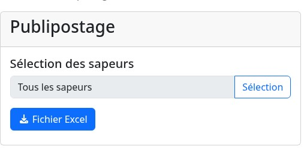

Le but du module publipostage est de permettre la récupération de toutes les données sapeurs nécessaires au publipostage.

Pour ce faire, ce module offre la possibilité de récupérer ces données au format `Excel (.xlsx)` via un simple clic sur le bouton [!badge Fichier Excel].

## Sélection des sapeurs

Par défaut, l'ensemble des sapeurs est sélectionné mais il est possible de restreindre la sélection !

Pour ce faire, cliquez sur le champ `Sélection des sapeurs` ou sur le bouton [!badge Sélection] : la fenêtre de sélection s'ouvre et permet de choisir les sapeurs voulus.

[!ref icon="rocket" text="Fenêtre de sélection"](../outils/fenetre-selection.md)

Une fois une sélection restreinte faite, il est possible de la réinitialiser à l'aide du bouton [!badge Réinitialiser].
